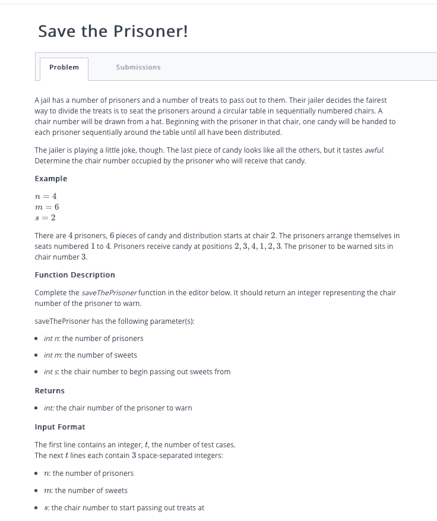

A jail has a number of prisoners and a number of treats to pass out to them. Their jailer decides the fairest way to divide the treats is to seat the prisoners around a circular table in sequentially numbered chairs. A chair number will be drawn from a hat. Beginning with the prisoner in that chair, one candy will be handed to each prisoner sequentially around the table until all have been distributed.

The jailer is playing a little joke, though. The last piece of candy looks like all the others, but it tastes awful. Determine the chair number occupied by the prisoner who will receive that candy.

Example

There are  prisoners,  pieces of candy and distribution starts at chair . The prisoners arrange themselves in seats numbered  to . Prisoners receive candy at positions . The prisoner to be warned sits in chair number .

Function Description

Complete the saveThePrisoner function in the editor below. It should return an integer representing the chair number of the prisoner to warn.

saveThePrisoner has the following parameter(s):

int n: the number of prisoners
int m: the number of sweets
int s: the chair number to begin passing out sweets from
Returns

int: the chair number of the prisoner to warn
Input Format

The first line contains an integer, , the number of test cases.
The next  lines each contain  space-separated integers:

: the number of prisoners
: the number of sweets
: the chair number to start passing out treats at
Constraints

Sample Input 0

2
5 2 1
5 2 2
Sample Output 0

2
3
Explanation 0

In the first query, there are  prisoners and  sweets. Distribution starts at seat number . Prisoners in seats numbered  and  get sweets. Warn prisoner .

In the second query, distribution starts at seat  so prisoners in seats  and  get sweets. Warn prisoner .

Sample Input 1

2
7 19 2
3 7 3
Sample Output 1

6
3
Explanation 1

In the first test case, there are  prisoners,  sweets and they are passed out starting at chair . The candies go all around twice and there are  more candies passed to each prisoner from seat  to seat .

In the second test case, there are  prisoners,  candies and they are passed out starting at seat . They go around twice, and there is one more to pass out to the prisoner at seat .