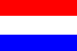

# 75. Sort Colors

Medium

Given an array nums with n objects colored red, white, or blue, 
sort them in-place so that objects of the same color are 
adjacent, with the colors in the order red, white, and blue.

We will use the integers `0`, `1`, and `2` to represent the 
color red, white, and blue, respectively.

You must solve this problem without using the library's sort function.


Example 1:
```
Input: nums = [2,0,2,1,1,0]
Output: [0,0,1,1,2,2]
```
Example 2:
```
Input: nums = [2,0,1]
Output: [0,1,2]
```
Example 3:
```
Input: nums = [0]
Output: [0]
```
Example 4:
```
Input: nums = [1]
Output: [1]
```


Constraints:

* `n == nums.length`
  
* `1 <= n <= 300`
  
* `nums[i]` is `0`, `1`, or `2`.


**Follow up:** Could you come up with a one-pass algorithm 
using only constant extra space?

https://users.monash.edu/~lloyd/tildeAlgDS/Sort/Flag/

Dijkstra used the Dutch National Flag Problem* as a structured programming exercise in program 
derivation and program proof. Given `N' objects coloured red, white or blue, sort them so that 
objects of the same colour are adjacent, with the colours in the order red, white and blue.

The problem is closely related to the partition operation of quick sort: the attribute need
not be a `colour' but can be `greater than the median', or `leading digit is zero', or 
whatever property you care to choose.

### Two Colours

It is easiest to consider just two "colours", {zero,one}, first. The algorithm maintains three 
sections (possibly empty) in the array a[ ]:
```
    a[1..Lo-1] zeroes
    a[Lo..Hi] unknown
    a[Hi+1..N] ones
```
The unknown section is shrunk while maintaining these conditions:
```
        Lo := 1; Hi := N;
        while Lo <= Hi do
            Invariant: a[1..Lo-1] are all zero and a[Hi+1..N] are all one; a[Lo..Hi] are unknown.
            if a[Lo] = 0 then Lo++
            else swap a[Lo] and a[Hi]; Hi--

    --- 2-way Partitioning --- 
```

### Three Colours



The problem was posed with three colours, here `0', `1' and `2'. The array is divided into four 
sections:
```
    a[1..Lo-1] zeroes (red)
    a[Lo..Mid-] ones (white)
    a[Mid..Hi] unknown
    a[Hi+1..N] twos (blue)
```
The unknown region is shrunk while maintaining these conditions
```
1. Lo := 1; Mid := 1; Hi := N;
2. while Mid <= Hi do
  1. Invariant: a[1..Lo-1]=0 and a[Lo..Mid-1]=1 and a[Hi+1..N]=2; a[Mid..Hi] are unknown.
  2. case a[Mid] in
    0: swap a[Lo] and a[Mid]; Lo++; Mid++
    1: Mid++
    2: swap a[Mid] and a[Hi]; Hi--

--- Dutch National Flag Algorithm, or 3-way Partitioning --- 
```

Part way through the process, some red, white and blue elements are known and are in the "right" place. The section of unknown elements, a[Mid..Hi], is shrunk by examining a[Mid]:
```
                |
    0 0 0 1 1 1 ? ? ? ? 2 2 2
          ^     ^     ^
          |     |     |
          Lo    Mid   Hi
```
Examine a[Mid]. There are three possibilities: a[Mid] is (0) red, (1) white or (2) blue.
Case (0) a[Mid] is red, swap a[Lo] and a[Mid]; Lo++; Mid++
```
    0 0 0 0 1 1 1 ? ? ? 2 2 2
            ^     ^   ^
            |     |   |
            Lo    Mid Hi

```
Case (1) a[Mid] is white, Mid++
```
    0 0 0 1 1 1 1 ? ? ? 2 2 2
          ^       ^   ^
          |       |   |
          Lo      Mid Hi
```
Case (2) a[Mid] is blue, swap a[Mid] and a[Hi]; Hi--
```
    0 0 0 1 1 1 ? ? ? 2 2 2 2
          ^     ^   ^
          |     |   |
          Lo    Mid Hi
```
Continue until Mid>Hi.


