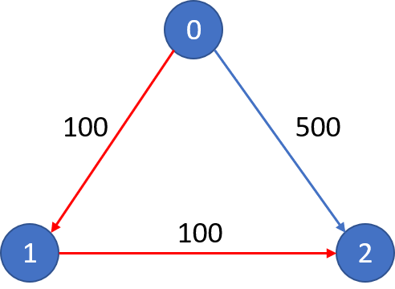

### 787. Cheapest Flights Within K Stops

https://leetcode.com/problems/cheapest-flights-within-k-stops/

`Medium`

There are `n` cities connected by `m` flights. Each `flight` where `flights[i] = [fromi, toi, pricei]` indicates that there is a flight from city `fromi` to city `toi` with cost `pricei`.

You are also given three integers `src`, `dst`, and `k`, return the cheapest price from `src` to `dst` with at most `k` stops. If there is no such route, return `-1`.

**Example 1:**


```
Input: 
n = 3, edges = [[0,1,100],[1,2,100],[0,2,500]]
src = 0, dst = 2, k = 1
Output: 200
Explanation: 
The graph looks like this:
```
The cheapest price from city 0 to city 2 with at most 1 stop costs 200, as marked red in the picture.

**Example 2:**



```
Input: 
n = 3, edges = [[0,1,100],[1,2,100],[0,2,500]]
src = 0, dst = 2, k = 0
Output: 500
Explanation: 
The graph looks like this:

```

The cheapest price from city 0 to city 2 with at most 0 stop costs 500, as marked blue in the picture.

**Constraints**:

* `1 <= n <= 100``
* `0 <= flights.length <= (n * (n - 1) / 2)``
* `flights[i].length == 3`
* `0 <= fromi, toi < n`
* `fromi != toi`
* `1 <= pricei <= 10^4``
* There will not be any multiple flights between two cities.
* `0 <= src, dst, k < n`
* `src != dst`
