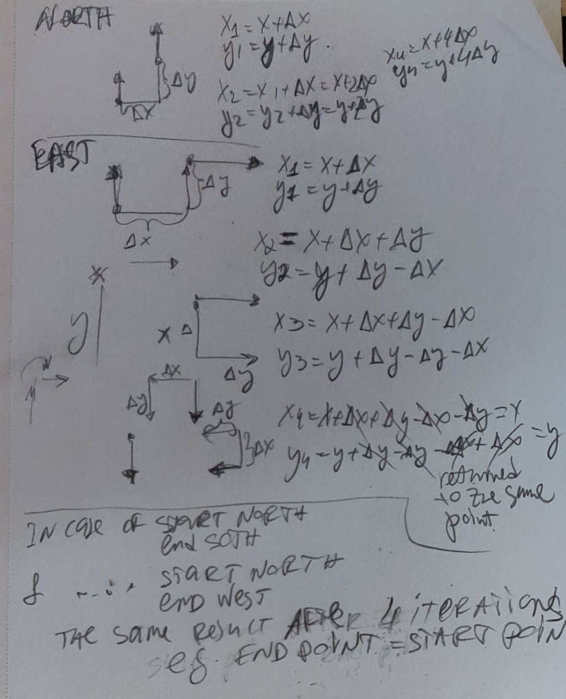

# 1041. Robot Bounded In Circle

Medium

On an infinite plane, a robot initially stands at `(0, 0)` and faces north. The robot can receive ]
one of three instructions:

* `"G"`: go straight 1 unit;
* `"L"`: turn 90 degrees to the left;
* `"R"`: turn 90 degrees to the right.
The robot performs the instructions given in order, and repeats them forever.

Return `true` if and only if there exists a `circle` in the plane such that the robot never leaves 
the circle.

Example 1:
```
Input: instructions = "GGLLGG"
Output: true
Explanation: The robot moves from (0,0) to (0,2), turns 180 degrees, and then returns to (0,0).
When repeating these instructions, the robot remains in the circle of radius 2 centered at the origin.
```
Example 2:
```
Input: instructions = "GG"
Output: false
Explanation: The robot moves north indefinitely.
```
Example 3:
```
Input: instructions = "GL"
Output: true
Explanation: The robot moves from (0, 0) -> (0, 1) -> (-1, 1) -> (-1, 0) -> (0, 0) -> ...
```

Constraints:

* `1 <= instructions.length <= 100`
* `instructions[i]` is `'G'`, `'L'` or, `'R'`.

## Proof
