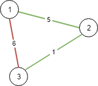

# 1135. Connecting Cities With Minimum Cost 
      
Medium
      
There are `n` cities labeled from `1` to `n`. You are given the integer `n` and an array connections 
where `connections[i] = [xi, yi, costi]` indicates that the cost of connecting city `xi` and city 
`yi `(bidirectional connection) is `costi`.

Return the minimum cost to connect all the `n` cities such that there is at least one path between 
each pair of cities. If it is impossible to connect all the `n` cities, return `-1`,

The cost is the sum of the connections' costs used.

**Example 1**:

```
Input: n = 3, connections = [[1,2,5],[1,3,6],[2,3,1]]
Output: 6
Explanation: Choosing any 2 edges will connect all cities so we choose the minimum 2.
```

**Example 2**:

```
Input: n = 4, connections = [[1,2,3],[3,4,4]]
Output: -1
Explanation: There is no way to connect all cities even if all edges are used.
```

Constraints:

* `1 <= n <= 104`
* `1 <= connections.length <= 10^4`
* `connections[i].length == 3`
* `1 <= xi, yi <= n`
* `xi != yi`
* `0 <= costi <= 105`