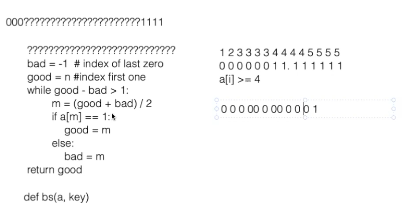

1146. Snapshot Array

https://leetcode.com/problems/snapshot-array

Medium

Implement a SnapshotArray that supports the following interface:

SnapshotArray(int length) initializes an array-like data structure with the given length. Initially, each element equals 0.
* void set(index, val) sets the element at the given index to be equal to val.
* int snap() takes a snapshot of the array and returns the snap_id: the total number of times we called snap() minus 1.
* int get(index, snap_id) returns the value at the given index, at the time we took the snapshot with the given snap_id
 

Example 1:
```
Input: ["SnapshotArray","set","snap","set","get"]
[[3],[0,5],[],[0,6],[0,0]]
Output: [null,null,0,null,5]
Explanation: 
SnapshotArray snapshotArr = new SnapshotArray(3); // set the length to be 3
snapshotArr.set(0,5);  // Set array[0] = 5
snapshotArr.snap();  // Take a snapshot, return snap_id = 0
snapshotArr.set(0,6);
snapshotArr.get(0,0);  // Get the value of array[0] with snap_id = 0, return 5
```

Constraints:

1 <= length <= 5 * 10^4
0 <= index < length
0 <= val <= 10^9
0 <= snap_id < (the total number of times we call snap())
At most 5 * 10^4 calls will be made to set, snap, and get.

## Template for Binary Search

Template for BS:
* 