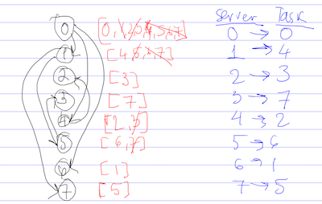

# Distribute Tasks

You need to distribute `2^k` tasks to `2^k` servers using divide and conquer algorithm:

* For the `first` server

  * First server when receiving tasks, splits tasks into two halfs: first half portion of tasks keeps to itself, `1/2`, second half handles to connected server, `1/2`
  * Remaining first half of tasks first server: keeps fist `1/4` (the first half of remaining first half of tasks from prev step) to itself and handles over the second `1/4` (the second half of remaining first half of tasks from prev step) of tasks to other connected server
  * Remaining fist quarter of tasks first server: keeps first `1/8` to itself and handles second `1/8` to other connected server and so on until it ends up with `1` task - the remaining single task. It is the task first server going to assign to itself

* For the `second` server: similar algo: it receives `1/2` tasks from first server (second half of tasks first sever received on start)
  * and needs to redistribute them `1/2 x 2^k tasks = 2^[k-1]` among `k-1` connected servers applying the same rule

* ...and so on...

* For the `nth` server: ...

All servers should be assigned one task in the end

Your task is to select a sequence of servers so that every server is mapped to one task

**Input**

* `2^k` servers
* `2^k` tasks
* `servers` are represented as array of connected srevers `connections = [(source, target)]` e.g. pairs of `(source server id, target server id)`

**API to implement**
```
int getTaskId(connections, int targetServer) { ... } // returns the task id assigned to target server
```

**Some edge cases**

* There might be not enough connections b/w servers - underconnected network of servers - in this case return null

* Serevers might be overconnected (connections more than required, e.g. the first selected server have more than k connected servers) - in this case output any working solution for task-2-server mapping

**More clarifications**
tasks are not given in problem statetement, but I assume its ok to have just array of incremented ids, starting from 1, e.g. tasks = taskIds = `[1,2,3,...,2^k]`


**Example 3**

In code - this example is mapped to `test3`:
* server ids: `[0,1,2, (2^k)-1]`
* task ids: `[0,1,2, (2^k)-1]`


